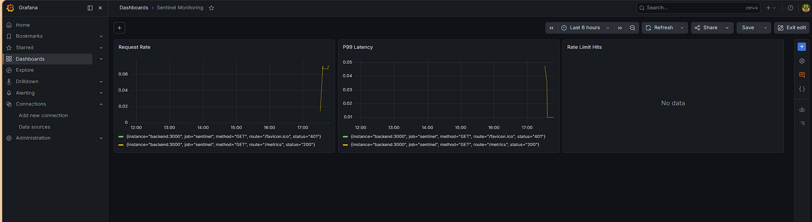

# Sentinel 🛡️

       

I kept seeing `x-api-key` headers in production APIs and wondering what was actually behind them. How do companies like Stripe or Twilio generate keys, track usage, and enforce rate limits per customer? I couldn't find a simple answer, so I built the whole thing myself.

**Live API:** http://15.207.91.11:3000
**Swagger docs:** http://15.207.91.11:3000/api-docs/

---

## What it does

Sentinel is an API key management platform. Users authenticate with Google OAuth, generate API keys tied to their account, and those keys are enforced on every request — rate limited by plan, tracked in real time, and revocable instantly. The React dashboard updates live over WebSockets so you can watch request counts go up as you hit the API.

Three plans: FREE (100 req/hr), BASIC (1000 req/hr), PRO (10000 req/hr).

---

## Technical decisions worth explaining

**Why Redis for rate limiting instead of a database counter?**
The first thing I considered was just incrementing a counter in MySQL on every request. That works, but it means a DB write on every single API call — the thing that's supposed to be fast becomes a bottleneck. Redis keeps the counter in memory, so the increment is sub-millisecond. The rate limiter adds almost no latency to the request path.

**Atomic Lua script for increment + expiry**
The naive Redis approach is two calls: `INCR` the counter, then `EXPIRE` it if it's new. The problem is that's not atomic — under high concurrency, two requests can both see `current == 1` and both try to set the TTL, or worse, one request increments but crashes before setting the TTL and the key never expires. I replaced this with a Lua script that runs both operations in a single atomic network call. This is how production rate limiters actually work.

```lua
local current = redis.call('INCR', KEYS[1])
if current == 1 then
  redis.call('EXPIRE', KEYS[1], ARGV[1])
end
return {current, redis.call('TTL', KEYS[1])}
```

**IP-based fallback for unauthenticated requests**
If a request arrives without an API key, instead of just returning 401 immediately, I first check how many requests that IP has made in the last 60 seconds. If it's over 20, it gets a 429. This prevents someone from hammering the auth layer without a key and effectively DDoSing the validation logic.

**Why Prisma over raw SQL?**
I could have written raw queries, but Prisma gives me type-safe database access — if I try to query a field that doesn't exist, it fails at compile time, not at runtime in production. For a project where the schema is evolving, that matters. It also generates a migration history, which means schema changes are tracked and reproducible.

**Why Google OAuth instead of username/password?**
Two reasons. First, storing passwords means hashing, salting, reset flows, and breach responsibility — all of that is on you. Delegating auth to Google means Google handles credential security. Second, in the real world, internal tools and developer platforms almost always use SSO. Building it myself was the fastest way to understand how OAuth 2.0 actually works — the redirect flow, the callback, the token exchange.

**WebSockets for the dashboard**
Polling would work — hit `/api/keys/user/:id` every few seconds. But WebSockets let the server push updates the moment something changes. When you generate a key or a request comes in, the dashboard updates immediately. The tradeoff I'm aware of: WebSocket connections are sticky to a server instance. If you scale to multiple containers behind a load balancer, connections on instance A don't see events from instance B. The fix is Redis Pub/Sub — each server instance subscribes to a shared channel and rebroadcasts to its own connected clients. Not implemented here, but that's the production path.

**Async request logging (AWS SQS + Lambda)**
API usage is tracked via a message queue instead of a synchronous database write. When a request hits a protected route, the API key is sent to an SQS queue on the hot path (non-blocking); an AWS Lambda function, running inside the same VPC as the database, consumes the queue in batches and updates request counts in MySQL. This removes database writes from the request path entirely, and Lambda's partial-batch-failure reporting means a single bad message doesn't block the rest of the batch. See [infra/main.tf](infra/main.tf) for the SQS queue, Lambda function, and IAM roles, and [lambda/index.js](lambda/index.js) for the consumer.

**CI/CD with GitHub Actions**
Every push to main spins up MySQL, Redis, and MongoDB in GitHub's runners, runs Prisma migrations, and executes the full test suite. If tests fail, the push is blocked. This isn't just for show — it caught two real bugs during development where a schema change broke a query that the TypeScript compiler didn't catch.

---

## Stack

TypeScript · Node.js · Express · MySQL · Prisma ORM · Redis · React · Vite · Google OAuth 2.0 · Passport.js · WebSockets · Docker Compose · Kubernetes · AWS EC2 · AWS SQS · AWS Lambda · Terraform · GitHub Actions · Swagger/OpenAPI 3.0

---

## Monitoring

Prometheus scrapes metrics every 15 seconds. Grafana dashboard tracks three signals:

- **Request Rate** — `rate(sentinel_http_requests_total[5m])`
- **P99 Latency** — `histogram_quantile(0.99, rate(sentinel_http_request_duration_seconds_bucket[5m]))`
- **Rate Limit Hits** — `rate(sentinel_rate_limit_hits_total[5m])`



Grafana runs at `http://localhost:3002`. Prometheus at `http://localhost:9090`.

---

## Load Testing

Tested with Locust at 300 concurrent users against the rate-limited `/keys/user/:id` endpoint (FREE plan, 100 req/hr limit).

| Metric | Value |
|--------|-------|
| Sustained throughput | ~480 req/s |
| Median latency | 230ms |
| P99 latency | 720ms |
| P99.9 latency | 1.5s |

The Redis-backed limiter enforced the 100 req/hr cap exactly — 100 requests succeeded, the remaining traffic correctly received `429` with proper `X-RateLimit-*` headers. No errors or crashes at 300 concurrent users on a t3.small instance.

Full results: [docs/LOAD_TEST.md](docs/LOAD_TEST.md)

## Run locally

```bash
git clone https://github.com/saithrishadaggupati/sentinel.git
cd sentinel
cp .env.example .env
# Fill in your Google OAuth credentials and database URLs
docker compose up --build
```

Backend at `http://localhost:3000`. React dashboard at `http://localhost:3001`. Swagger at `http://localhost:3000/api-docs/`.

---

## Infrastructure as Code

The EC2 instance, security group, Elastic IP, SQS queue, and Lambda consumer are all provisioned with Terraform instead of manual console setup — see [infra/](infra/).

```bash
cd infra
terraform init
terraform plan
terraform apply
```

---

## Kubernetes

For local demonstration of production-style orchestration, the app can also run on Kubernetes instead of Docker Compose — see [k8s/](k8s/) for manifests (Deployments, Services, ConfigMap, Secret template, PersistentVolumeClaim for MySQL) and [k8s/README.md](k8s/README.md) for setup instructions. Verified self-healing: deleting a pod triggers automatic recreation by the Deployment controller within seconds.

---

## API overview

| Method | Endpoint | Description |
|--------|----------|-------------|
| GET | `/auth/google` | OAuth login redirect |
| GET | `/auth/logout` | Logout |
| POST | `/keys/generate` | Generate API key (returns full key once) |
| GET | `/keys/user/:userId` | List keys — key value excluded from response |
| DELETE | `/keys/:id` | Revoke key — marks inactive, preserves audit record |

Every protected route requires `x-api-key` header. Rate limit headers returned on every response: `X-RateLimit-Limit`, `X-RateLimit-Remaining`, `X-RateLimit-Reset`, `X-RateLimit-Plan`.

---

## Tests

```bash
npm test
```

12 tests across 2 files — rate limiter (Redis counter, TTL, blocking logic) and API keys (generation, listing without exposing raw key, revocation, audit preservation).

---

## Known limitations

**WebSocket scaling** — connections are in-memory per server instance. Multi-container deployment would need Redis Pub/Sub as a shared message broker so all instances can broadcast to each other's clients.

**API key shown once** — on generation, the full key is returned and never retrievable again. This is intentional and matches how Stripe/GitHub handle it, but there's no recovery path if you lose it. A real system would also support key rotation.
